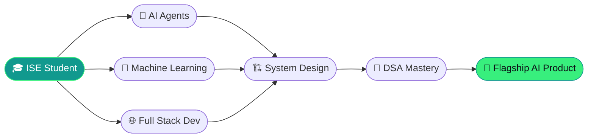

<!-- ====================== HERO ====================== -->
<div align="center">


<a href="https://github.com/spandana-builds">
  
</a>

<br/>

<p>
  
  
  
</p>

<p>
  <a href="https://www.linkedin.com/in/your-linkedin"></a>
  <a href="mailto:your.email@example.com"></a>
  <a href="https://twitter.com/your-handle"></a>
  
</p>

</div>

---

## 👋 Who I Am — in 10 seconds

> I'm **Spandana** — an **Information Science & Engineering student (6th semester)** who builds, not just studies.
> I turn ideas into shipped products at the intersection of **AI/ML, Agentic AI, and Full Stack Development**, and I founded **🌱 Hasiru Haadi**, a plant & sustainability initiative.
> Driven by one thing: **solving real-world problems with technology.**

```python
class Spandana:
    def __init__(self):
        self.role        = "ISE Student • Builder • Founder"
        self.focus       = ["AI Agents", "Machine Learning", "Full Stack", "Products"]
        self.founder_of  = "Hasiru Haadi 🌱"
        self.mission     = "Solve real problems with technology"
        self.currently   = "Building AI tools that actually ship"

    def beyond_code(self):
        return ["🌿 Gardening", "🌍 Sustainability", "✍️ Writing", "💡 Creative problem solving"]
```

---

## 🛠️ Tech Toolbox

<div align="center">

**Languages**


**AI / ML & Agentic AI**


**Full Stack & Tools**


</div>

---

## 🚀 Featured Project: Hasiru Haadi

<table>
  <tr>
    <td width="55%" valign="top">

### 🌱 Hasiru Haadi
**Plant & sustainability initiative I founded.**

A community-driven effort to make gardening, green living, and sustainability
accessible — blending **technology + nature** to encourage people to grow,
care for, and learn about plants.

- 🌍 Mission: make sustainability a daily habit, not an afterthought
- 🤝 Community-first, education-driven
- 🌿 Where my love for nature meets product building

`#Sustainability` `#GreenTech` `#Community` `#Founder`

[**🔗 Explore the project →**](https://github.com/spandana-builds)

</td>
<td width="45%" valign="top" align="center">


</td>
  </tr>
</table>

---

## 🤖 AI Agent Projects

<div align="center">
<table>
<tr>
<td width="50%" valign="top">

### 🌾 AI Farming Advisor
An agentic assistant that gives farmers **crop, soil, and weather-aware guidance** using ML + LLMs.

`Agentic AI` · `LangChain` · `ML`

[`→ View Repo`](https://github.com/spandana-builds)

</td>
<td width="50%" valign="top">

### 🔍 RepoInsight
An AI agent that **analyzes GitHub repositories** and produces instant insights, summaries & health reports.

`LLM Agents` · `Python` · `GitHub API`

[`→ View Repo`](https://github.com/spandana-builds)

</td>
</tr>
<tr>
<td width="50%" valign="top">

### 🧠 Flagship AI Project *(coming soon)*
My future **flagship agentic AI product** — an autonomous system that plans, reasons, and executes real tasks end-to-end.

`Multi-Agent` · `Reasoning` · `Tooling`

`🔒 In stealth — stay tuned`

</td>
<td width="50%" valign="top">

### 💡 Why agents?
I believe the next wave of products will be **autonomous, helpful, and grounded in real-world problems** — so that's where I'm building.

`Vision` · `Agentic AI` · `Products`

</td>
</tr>
</table>
</div>

---

## 🌱 Plant-Tech Experiments

> Where my two worlds collide — **AI + nature**. 🌿

| Experiment | What it does | Stack |
| :--- | :--- | :--- |
| 📖 **Plant Story Archive** | Documents & narrates plant journeys with AI-generated stories | `Python` · `LLM` · `Storytelling` |
| 🌾 **AI Farming Advisor** | Smart, region-aware crop & care recommendations | `ML` · `Agentic AI` |
| 🌱 **Hasiru Haadi Tools** | Tooling & content powering the sustainability initiative | `Full Stack` · `Community` |

---

## 📈 What I'm Learning Now

```text
🤖 Agentic AI        ███████████████░░░░░   78%   →  Multi-agent orchestration & tool use
🧠 Machine Learning  █████████████░░░░░░░   68%   →  Deep learning & model deployment
🌐 Full Stack Dev    ██████████████░░░░░░   72%   →  Scalable, production-ready apps
🏗️ System Design     █████████░░░░░░░░░░░   48%   →  Designing reliable systems at scale
🧩 DSA               ████████████░░░░░░░░   62%   →  Sharpening problem-solving daily
```

---

## 📊 GitHub Stats

<div align="center">


<br/>


<br/>


</div>

---

## 🗺️ My Roadmap



---

## 🎯 2026 Goals

- [ ] 🏢 Land a **software engineering internship** (AI/ML or Full Stack)
- [ ] 🚀 Ship my **flagship agentic AI product** publicly
- [ ] 🌱 Scale **Hasiru Haadi** into a real community
- [ ] 🧩 Solve **300+ DSA problems** and master core patterns
- [ ] 🏗️ Build & deploy **3 production-grade full-stack apps**
- [ ] ✍️ Write & share what I learn — build in public

---

## 🌿 Beyond Code

When I step away from the keyboard, I'm probably:

🌱 **Gardening** — growing things teaches patience & systems thinking
🌍 **Championing sustainability** — through Hasiru Haadi
✍️ **Writing** — reflecting, sharing, telling stories
💡 **Creative problem solving** — the habit that powers everything I build

> *"I build technology the same way I grow a garden — patiently, intentionally, and for the long term."*

---

<div align="center">

### 💬 Let's build something meaningful together.


</div>
